# Cavity Flow — PINN Experiments Summary

A series of experiments solving the **lid-driven cavity flow** problem on the unit square $[0,1]^2$ using Physics-Informed Neural Networks (PINNs). The reference FEM solution is stored in `cavity_solution.h5` (10,000 scattered points with fields `x`, `y`, `ux`, `uy`, `p`).

The steady incompressible Navier-Stokes equations are solved:

$$u \partial_x u + v \partial_y u + \partial_x p - \nu\,\Delta u = 0$$
$$u \partial_x v + v \partial_y v + \partial_y p - \nu\,\Delta v = 0$$
$$\partial_x u + \partial_y v = 0$$

with $\text{Re} = 1000$, $\nu = 10^{-3}$.

---

## 1. Smooth Lid Boundary — Hard Dirichlet Enforcement

**Notebook:** `lid_cavity_hard_dirichlet.ipynb`

### Setup

| Item | Value |
|---|---|
| Model | Mixture-of-Experts (MoE) PINN, outputs $(u, v)$ and $p$ jointly |
| Architecture | Expert heads: `[64,64,64]` for velocity, `[32,32,32]` for pressure |
| Boundary condition style | Hard enforcement via constraint multiplication |
| Optimizer | Adam → L-BFGS switch, `ReduceLROnPlateau` |
| Training epochs | 120,000 |
| Interior sampling | Latin Hypercube, $N=10{,}000$ |
| Reynolds number | 1000 |

### Boundary Conditions

- **No-slip walls** (bottom, left, right): $u = v = 0$ enforced via multiplicative factor $f(x) = x_0(x_0-1)\,x_1(x_1-1)$.
- **Lid (top, $y=1$):** smooth polynomial profile

$$u_{\text{lid}}(x) = 16\,x^2(1-x)^2$$

which vanishes at the corners, avoiding the classical corner singularity. Enforced via additive lift $g_N$.

### Training

The hard-enforcement architecture wraps the neural network output as:

$$\hat{u} = g_N(x) + f(x) \odot \text{NN}(x)$$

so boundary conditions are **satisfied exactly at every iteration**, removing any boundary loss term.

Training loss combines the momentum residuals and continuity residual, monitored with per-component gradient norms.

| Metric | Value |
|---|---|
| Total loss (final) | see plot below |
| Continuity loss | see plot below |

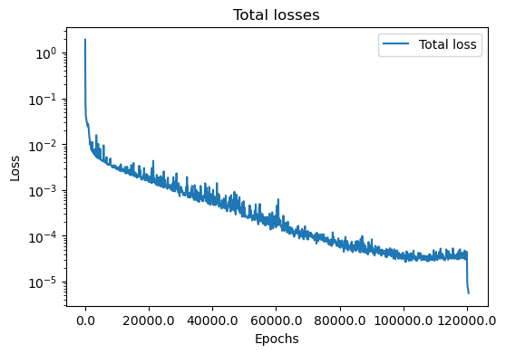

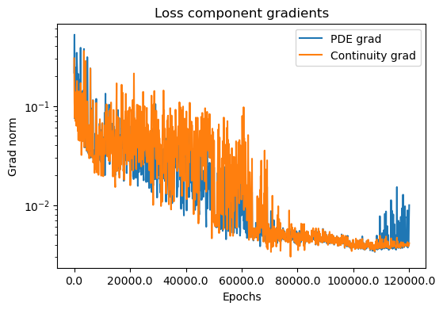

### Results

**Velocity field and PDE residuals:**

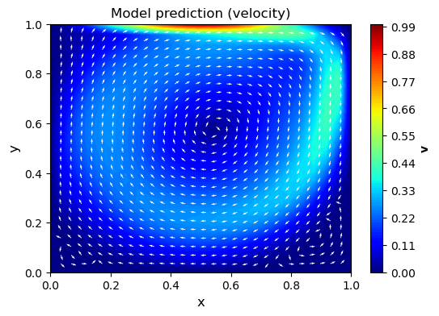

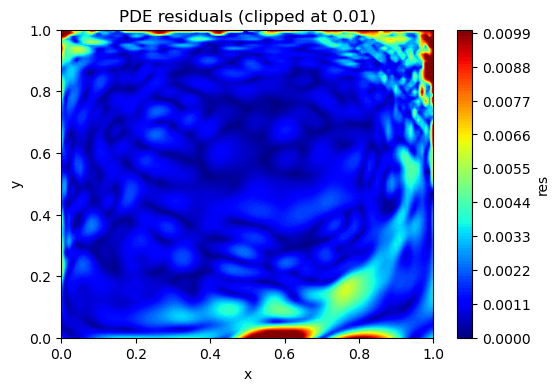

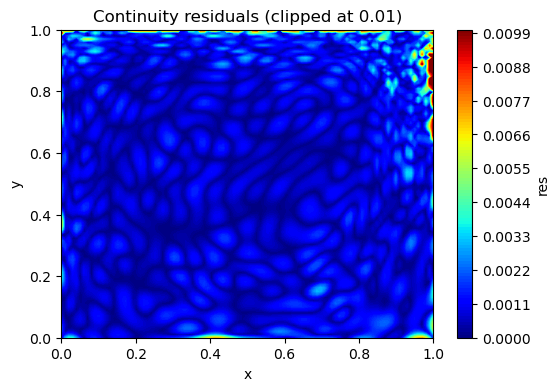

**Absolute error vs FEM reference:**

| Field | Mean \|err\| | Max \|err\| | L2 err |
|---|---|---|---|
| $u_x$ | 0.003785 | 0.018384 | 0.557 |
| $u_y$ | 0.002501 | 0.013898 | 0.379 |

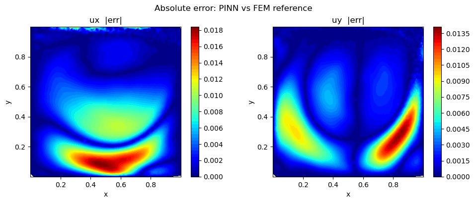

The smooth lid profile eliminates corner singularities and the MoE model with hard Dirichlet enforcement achieves low pointwise errors relative to the FEM solution.

---

## 2. Smooth Parabolic Lid — Hard Dirichlet, MoE Model

**Notebook:** `lid_cavity_hard_dirichlet.ipynb`

### Setup

| Item | Value |
|---|---|
| Model | Mixture-of-Experts (MoE) PINN, outputs $(u, v)$ and $p$ jointly |
| Architecture | Expert heads: `[64,64,64]` for velocity, `[32,32,32]` for pressure |
| Boundary condition style | Hard enforcement via constraint multiplication |
| Optimizer | Adam → L-BFGS switch, `ReduceLROnPlateau` (`patience=2000`, `min_lr=1e-6`) |
| Training epochs | 120,000 |
| Interior sampling | Latin Hypercube, $N=10{,}000$, resampled each epoch |
| Reynolds number | 1000 |

### Boundary Conditions

- **No-slip walls** (bottom, left, right): $u = v = 0$ enforced via multiplicative zero-boundary factor

$$f(x) = x_0(x_0-1)\,x_1(x_1-1)$$

- **Lid (top, $y=1$):** parabolic profile — **continuous but not smooth** ($C^0$), vanishes at both corners:

$$u_{\text{lid}}(x) = 4\,x(1-x)$$

  Enforced as an additive lift $g_N(x) = 4\,x_0(1-x_0)\,x_1\,\hat{e}_x$, which satisfies $g_N = u_{\text{lid}}$ at $y=1$ and $g_N = 0$ on all other walls.

### Training

Hard enforcement wraps the network as:

$$\hat{\mathbf{u}} = g_N(x) + f(x) \odot \text{NN}(x)$$

so BCs are **satisfied exactly at every step** with no boundary loss term. The PDE loss is

$$\mathcal{L} = 2.5\,\langle r_u^2 + r_v^2 \rangle + \langle (\nabla\cdot\mathbf{u})^2 \rangle$$

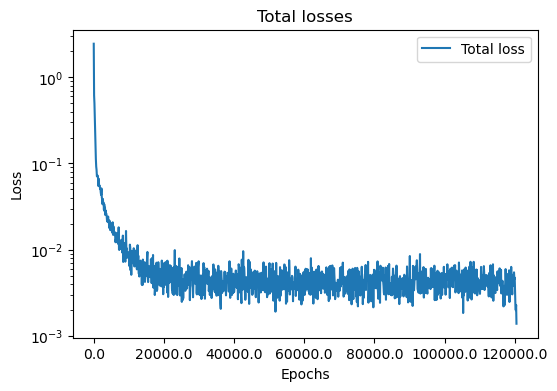

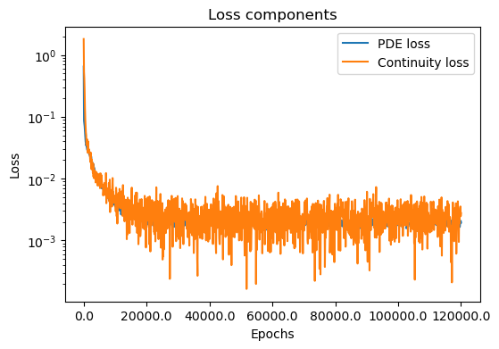

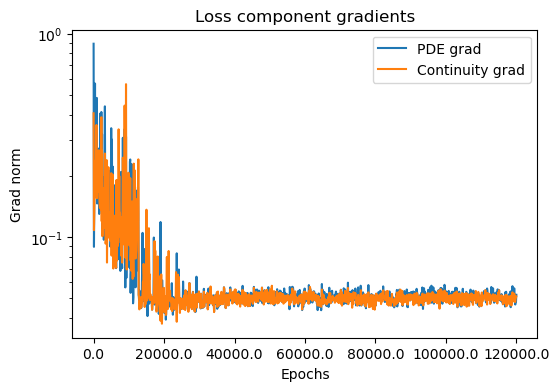

### Results

**Predicted velocity field:**

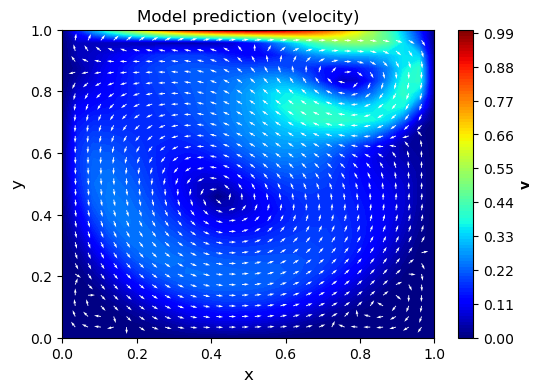

**PDE and continuity residuals (clipped at 0.01):**

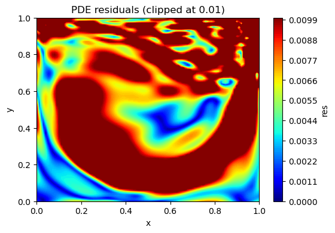

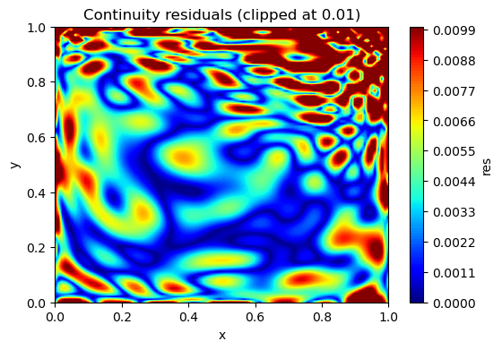

**Absolute error vs FEM reference:**

| Field | Mean \|err\| | Max \|err\| | L2 err |
|---|---|---|---|
| $u_x$ | 0.175408 | 0.498413 | 22.813469 |
| $u_y$ | 0.161645 | 0.486750 | 21.244179 |

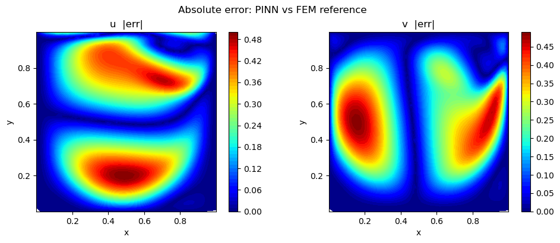

---

## 3. Almost-Constant Bump Lid — Hard Dirichlet, MoE Model

**Notebook:** `lid_cavity_hard_dirichlet.ipynb`

### Setup

| Item | Value |
|---|---|
| Model | Mixture-of-Experts (MoE) PINN, outputs $(u, v)$ and $p$ jointly |
| Architecture | Expert heads: `[64,64,64]` for velocity, `[32,32,32]` for pressure |
| Boundary condition style | Hard enforcement via constraint multiplication |
| Optimizer | Adam → L-BFGS switch, `ReduceLROnPlateau` (`patience=2000`, `min_lr=1e-6`) |
| Training epochs | 120,000 |
| Interior sampling | Latin Hypercube, $N=10{,}000$, resampled each epoch |
| Reynolds number | 1000 |

### Boundary Conditions

- **No-slip walls** (bottom, left, right): $u = v = 0$ enforced via multiplicative factor

$$f(x) = x_0(x_0-1)\,x_1(x_1-1)$$

- **Lid (top, $y=1$):** smooth bump profile based on the infinitely differentiable bump function

$$h(x) = \begin{cases} e^{-1/x} & x > 0 \\ 0 & x \le 0 \end{cases}, \qquad B(x;\,r_1,r_2) = \frac{h(r_2-x)}{h(r_2-x)+h(x-r_1)}$$

with $r_1=0.2$, $r_2=0.5$, so that the lid velocity is

$$u_{\text{lid}}(x) = B(|x - 0.5|)$$

which is **$C^\infty$**, nearly flat (≈ 1) over the central portion of the lid and tapers smoothly to zero at both corners — a profile avoiding both the corner singularity and the non-smoothness of the parabolic profile. The lift function is

$$g_N(x) = B(|x_0 - 0.5|)\,x_1\,\hat{e}_x$$

### Training

Hard enforcement wraps the network as:

$$\hat{\mathbf{u}} = g_N(x) + f(x) \odot \text{NN}(x)$$

BCs are satisfied exactly at every iteration with no boundary loss term.

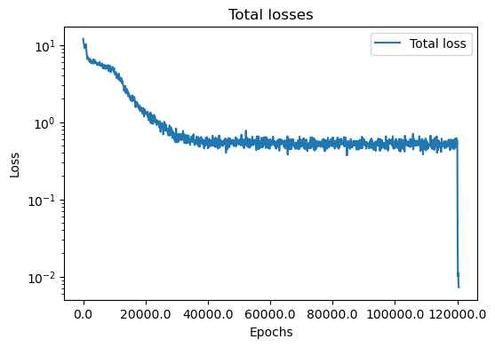

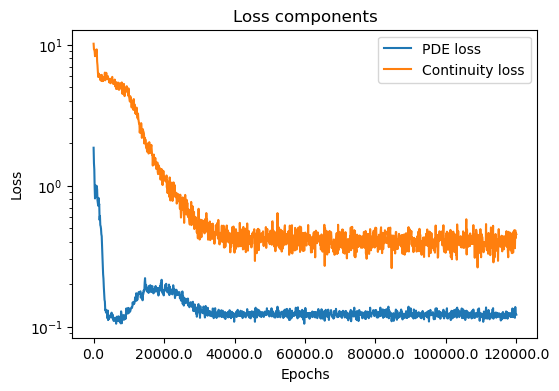

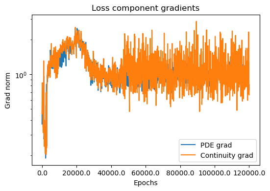

### Results

**Predicted velocity field:**

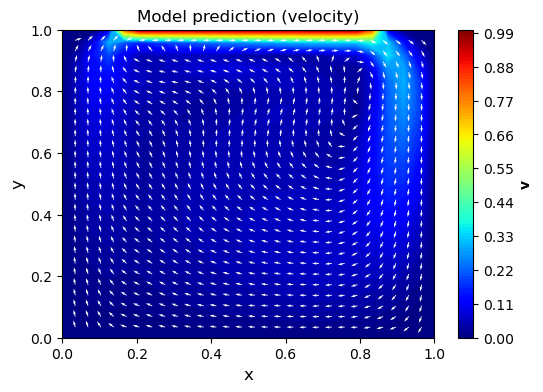

**PDE and continuity residuals (clipped at 0.01):**

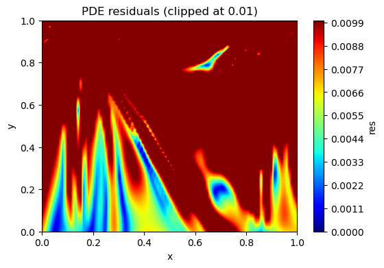

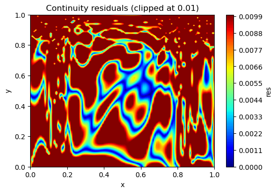

The $C^\infty$ bump lid profile eliminates corner singularities while maintaining a nearly uniform lid velocity over most of the top boundary. For some reason, even though the boundary is smooth, the network still struggles to learn. Probably some technical issue.

---

## 4. Other Boundary Types — *to be added*

Additional experiments planned:
- Inflow/outflow boundaries (Neumann conditions on pressure)
- Mixed Dirichlet–Neumann setups
- Periodic boundaries
