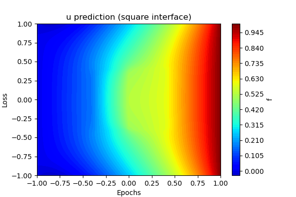
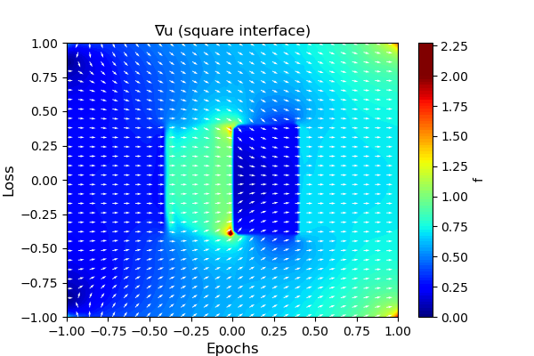
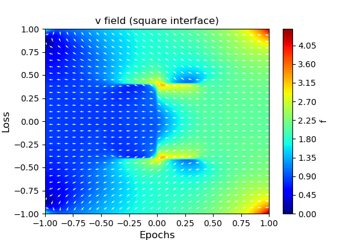
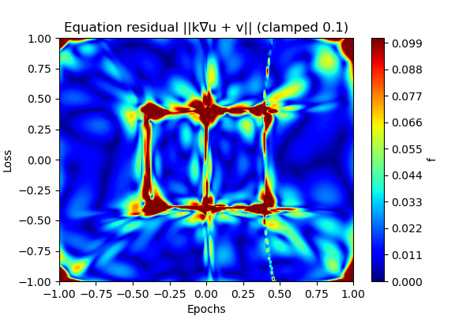
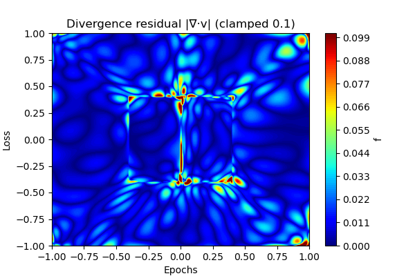
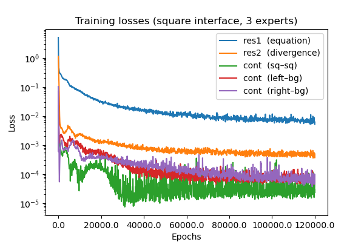
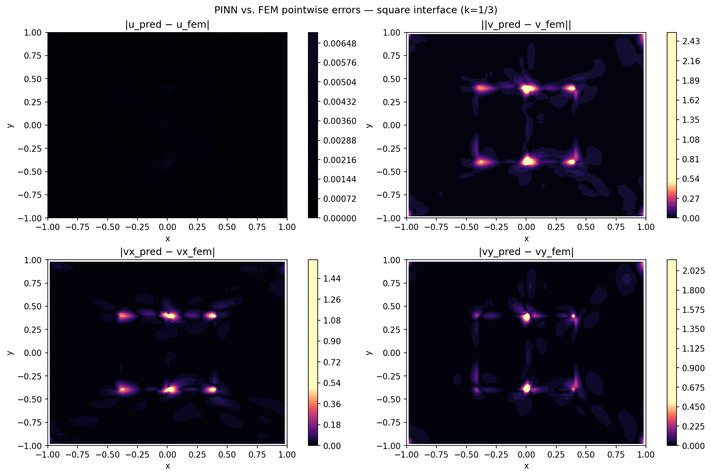

# Hard Dirichlet Darcy — Two Touching Squares with Learned POU

**Date:** April 7, 2026

---

## TL;DR

- We solve mixed-form Darcy flow on $[-1,1]^2$ with a **three-region piecewise-constant permeability** ($k=1$ left square, $k=10$ right square, $k=3$ exterior background). The two inner squares share the edge $x=0,\,|y|\le0.4$, creating a $1:10$ permeability contrast across the interface.
- The partition of unity (POU) is **not prescribed analytically** — two classifier MLPs (`model_char_1`, `model_char_2`) are trained first (Stage 1) to learn smooth indicators of the two inner regions from the permeability field alone.
- The learned POU contours are extracted at level 0.5 (arbitrary value), split into three interface sub-curves (sq–sq, left–bg, right–bg), and used in Stage 2 to compute outward unit normals via autodiff.
- Stage 3 trains a combined model with **three expert sub-networks** gated by the frozen POU classifiers — one expert per permeability region — with flux-continuity losses enforced across all three interface sub-curves.
- The FEM reference is produced by `darcy_two_square_fem.py` (250×250 P1 mesh, direct solver) and saved to `darcy_two_square_solution.h5`.

---

## 1. Problem Statement

We solve the mixed-form Darcy flow problem on the unit square $\Omega = [-1,1]^2$:

$$\begin{align}
-k\,\nabla u &= v && \text{in } \Omega \\
\nabla \cdot v &= 0 && \text{in } \Omega \\
u &= g_D && \text{on } \Gamma_D \\
v &= h && \text{on } \Gamma_N
\end{align}$$

### Domain and permeability

The permeability field is piecewise constant over **three regions**:

$$k(x,y) = \begin{cases}
    1  & -0.4 \le x \le 0,\; |y| \le 0.4 & (\text{left square}) \\
    10 & 0 \le x \le 0.4,\; |y| \le 0.4  & (\text{right square}) \\
    3  & \text{otherwise}                  & (\text{background})
\end{cases}$$

The two inner squares meet along the segment $x=0,\,|y|\le0.4$, giving rise to six non-smooth corners and two distinct types of interface: sq–sq (shared edge) and square–background.
The contrast $k_L/k_R = 1/10$ is significantly larger than in previous experiments.

### Boundary data

$$g_D(x) = \tfrac{1}{2}(x_1 + 1), \qquad h(x) = (0,\; x_2)^T$$

The domain boundary is split into:
- **Dirichlet** $\Gamma_D$: left/right edges ($x = \pm 1$), $u$ prescribed.
- **Neumann** $\Gamma_N$: top/bottom edges ($y = \pm 1$), flux $v \cdot n$ prescribed.

---

## 2. Hard Enforcement of Boundary Conditions

All models use **hard enforcement** — boundary conditions are embedded directly in the network output, guaranteeing exact satisfaction for any weight configuration.

### Pressure field $u$ — Dirichlet BC $u\big|_{x=\pm1} = g_D$

| Name | Expression | Role |
|---|---|---|
| `g_D(x)` | $\frac{1}{2}(x_1 + 1)$ | Lift: $0$ at $x=-1$, $1$ at $x=+1$ |
| `u_0(x)` | $1 - x_1^2$ | Mask: zero on $x = \pm 1$ |

$$u_\theta(x) = g_D(x) + u_0(x)\cdot\hat{u}_\theta(x)$$

### Flux field $v$ — Neumann BC $v_y\big|_{y=\pm1} = y$

| Name | Expression | Role |
|---|---|---|
| `h(x)` | $(0,\; x_2)^T$ | Lift: matches Neumann data on top/bottom |
| `v_0(x)` | $(1,\; 1-x_2^2)^T$ | Mask: $y$-component zero on $y=\pm 1$; $x$-component unconstrained |

$$v_\theta(x) = h(x) + v_0(x) \odot \hat{v}_\theta(x)$$

---

## 3. Stage 1 — Learning the Partition of Unity

Because the interface geometry is not given analytically to the model, two binary classifier MLPs are trained to detect each inner square from the permeability field:

| Model | Target region | Target $k$ | Loss |
|---|---|---|---|
| `model_char_1` | left square | $k=1$ | $\mathbb{E}\bigl[(\hat{u}_\theta - \mathbf{1}_{k=1})^2\bigr]$ |
| `model_char_2` | right square | $k=10$ | $\mathbb{E}\bigl[(\hat{u}_\theta - \mathbf{1}_{k=10})^2\bigr]$ |

The exterior region $k=3$ is recovered implicitly as $1 - \chi_1 - \chi_2$.

**Architecture** (both models): MLP $2 \to [64,64,64,64,64] \to 1$, ReLU final activation (outputs in $[0,\infty)$, thresholded at 0.5).  
**Training**: 60 000 Adam steps (lr $10^{-4}$) followed by 1 000 L-BFGS steps.  
**Frozen** after Stage 1 — no gradients flow through them during main training.

Learned binary indicators and their pointwise errors vs. the ground-truth step functions are visualised in `learned_pou_1.png`, `learned_pou_2.png`, `pou_error_1.png`, `pou_error_2.png`.

---

## 4. Stage 2 — Interface Contour Extraction

Each frozen classifier's 0.5-level-set is extracted on a $1400\times1400$ grid via `skimage.measure.find_contours`. The two raw contours are **split** into three semantically distinct sub-curves:

| Sub-curve | Source model | Physical interface |
|---|---|---|
| `contour_sq_sq` | `model_char_1` | Shared sq–sq edge ($x\approx 0$, $\|y\|\le0.4$) |
| `contour_left_bg` | `model_char_1` | Left square / background |
| `contour_right_bg` | `model_char_2` | Right square / background |

Points within `CORNER_RADIUS = 0.01` of any geometry corner are discarded.

**Outward unit normals** are computed via autodiff ($n = -\nabla_x m / \|\nabla_x m\|$ where $m$ is the classifier):

| Normal | Classifier | Points away from |
|---|---|---|
| `norm_sq_sq` | `model_char_1` | left square (into right square) |
| `norm_left_bg` | `model_char_1` | left square (into background) |
| `norm_right_bg` | `model_char_2` | right square (into background) |

Interface curves and normal vectors are visualised in `pou_interface_curves.png` and `normals_per_interface.png`.

---

## 5. Stage 3 — Main Model Training

Two sub-networks assembled into a `MultiModel`:

| Sub-model | Output | Architecture | Hard BC |
|---|---|---|---|
| `model_u_exp` | pressure $u$ | MLP $2\to[32,32,32]\to1$ | Dirichlet $g_D$ via `u_0` |
| `model_v_exp` | flux $v$ (3 experts) | 3 × MLP $2\to[16,16,16]\to2$ | Neumann $h$ via `v_0` |

### Expert gating

$$\hat{v}_\theta(x) = \chi_1(x)\,E_0(x) + \chi_2(x)\,E_1(x) + \chi_\text{ext}(x)\,E_2(x)$$

where $\chi_1, \chi_2, \chi_\text{ext}$ are the **frozen** learned POU functions (hard-thresholded at 0.5). Each expert specialises entirely on its own permeability region.

### Loss function (five components)

$$\mathcal{L} = \mathcal{L}_1 + \mathcal{L}_2 + \mathcal{L}_3 + \mathcal{L}_4 + \mathcal{L}_5$$

| Term | Expression | Description |
|---|---|---|
| $\mathcal{L}_1$ | $\mathbb{E}\bigl[\|k\nabla u + v\|^2\bigr]$ | Darcy law residual |
| $\mathcal{L}_2$ | $\mathbb{E}\bigl[(\nabla\cdot v)^2\bigr]$ | Mass conservation |
| $\mathcal{L}_3$ | $\mathbb{E}_\text{sq–sq}\bigl[(\langle E_0,n\rangle - \langle E_1,n\rangle)^2\bigr]$ | Flux continuity: left ↔ right |
| $\mathcal{L}_4$ | $\mathbb{E}_\text{left–bg}\bigl[(\langle E_0,n\rangle - \langle E_2,n\rangle)^2\bigr]$ | Flux continuity: left ↔ bg |
| $\mathcal{L}_5$ | $\mathbb{E}_\text{right–bg}\bigl[(\langle E_1,n\rangle - \langle E_2,n\rangle)^2\bigr]$ | Flux continuity: right ↔ bg |

Boundary conditions are not in the loss — satisfied exactly by hard enforcement.

### Training schedule

- **Collocation points**: 10 000 Latin-hypercube interior points (reduced from 30 000 used in Stage 1).
- **Adam**: 120 000 steps, lr $5\times10^{-4}$, `ReduceLROnPlateau` (factor 0.75, patience 2 000).
- **L-BFGS**: 1 000 steps (lr 0.1) appended after Adam.

---

## 6. FEM Reference

The reference solution is produced by `darcy_two_square_fem.py` (same directory):

- **Mesh**: 250×250 structured P1 triangles on $[-1,1]^2$; spacing $\Delta=0.008$ places all interfaces at exact mesh lines.
- **Solver**: direct sparse (`scipy.sparse.linalg.spsolve`); algebraic residual $\approx 9\times10^{-15}$.
- **Flux**: $v = -k\nabla u$ evaluated at element centroids (constant per P1 element), then interpolated to the sample grid.
- **Output** (`darcy_two_square_solution.h5`): 100×100 uniform sample grid with `samples/xy`, `samples/u_interp`, `samples/flux_interp`, `samples/kappa` — identical layout to `darcy_solution.h5`.

---

## 7. Visualisations

### Predicted pressure $u_\theta$

Contour plot of the PINN pressure prediction. Should show a smooth left-to-right ramp with a perceptible kink at the inner square boundaries.

---

### Gradient field $\nabla u_\theta$

$30\times30$ arrow plot of the pressure gradient. The gradient magnitude should be visibly larger inside the low-permeability left square ($k=1$) than in the high-permeability right square ($k=10$).

---

### Flux field $v_\theta$

Vector field of the Darcy flux. The magnitude should be approximately constant across the sq–sq interface (flux continuity) and jump at the square–background boundaries.

---

### PDE residuals

Pointwise equation residual $\|k\nabla u + v\|$ and divergence residual $|\nabla\cdot v|$, both clamped to $[0, 0.1]$.

| Equation residual | Divergence residual |
|:---:|:---:|
|  |  |

---

### Training loss curves

All five loss components over epochs (Adam + L-BFGS).

---

### FEM error maps

Pointwise error against the FEM reference `darcy_two_square_solution.h5`.

---

## 8. Quantitative Results

### L2 residual norms (PDE satisfaction, evaluated on a $50\times50$ grid)

| Model | $\|\mathcal{R}_1\|_{L^2}$ (Darcy law) | $\|\mathcal{R}_2\|_{L^2}$ (div-free) |
|---|---:|---:|
| `combined_exp` | 1.248808e-01 | 3.092180e-02 |

### Comparison vs FEM reference (`darcy_two_square_solution.h5`)

| Model | $u$ L2 | $u$ Rel. L2 | $u$ RMSE |
|---|---:|---:|---:|
| `combined_exp` | 8.0041e-02 | 1.5874e-03 | 8.0041e-04 |

---

## 9. Discussion

- **Three-region geometry is significantly harder** than the circular or single-square variants: the $1:10$ permeability contrast, the shared sq–sq edge, and the six non-smooth corners all stress the PINN approximation.
- **Learned POU avoids hard-coding the interface**: the two classifier MLPs successfully detect the inner squares purely from the permeability field, with pointwise errors on the order of $10^{-3}$ away from corners.
- **Three experts + three continuity losses** give the model explicit inductive bias for all three region boundaries, in contrast to the two-expert design used for simpler geometries.
- **Flux-continuity terms** ($\mathcal{L}_3$–$\mathcal{L}_5$) are critical for enforcing the physical interface condition $\langle v, n\rangle$ continuous across each sub-curve; without them the experts may converge to solutions that satisfy the PDE per-region but disagree at the interfaces.
