# Hard Dirichlet Darcy — Experiment Summary

**Date:** March 15, 2026

---

## TL;DR

- We solve mixed-form Darcy flow with a circular permeability jump ($k=1$ inside, $k=2$ outside) using hard-enforced boundary conditions.
- Three models are compared: expert-gated (`combined_exp`), discontinuous-activation (`combined_disc`), and smooth baseline (`combined_smooth`).
- The expert-gated model achieves the best PDE residual quality near the interface and the lowest Darcy-law $L^2$ residual.
- The smooth baseline remains competitive on FEM pressure error, while the discontinuous-activation model is harder to optimize.
- Main takeaway: characteristic-gated experts, while better at minimizing PDE residual, struggle to capture true nature of the PDE solution, performing even worse than the smooth baseline.

---

## 1. Problem Statement

We solve the mixed-form Darcy flow problem on the unit square $\Omega = [-1,1]^2$ with a piecewise-constant permeability $k$:

$$\begin{align}
-k\,\nabla u &= v && \text{in } \Omega \\
\nabla \cdot v &= 0 && \text{in } \Omega \\
u &= g_D && \text{on } \Gamma_D \\
v &= h && \text{on } \Gamma_N
\end{align}$$

### Domain and permeability

The permeability field is discontinuous across the circle $\|x\|_2 = 0.5$:

$$k(x) = \begin{cases} 1 & \|x\|_2 < 0.5 \\ 2 & \|x\|_2 \geq 0.5 \end{cases}$$

The domain boundary is split into:
- **Dirichlet** $\Gamma_D$: the left and right edges ($x_1 = \pm 1$), where $u$ is prescribed.
- **Neumann** $\Gamma_N$: the top and bottom edges ($x_2 = \pm 1$), where the flux $v$ is prescribed.

### Boundary data

$$g_D(x) = \tfrac{1}{2}(x_1 + 1), \qquad h(x) = (0,\; x_2)^T$$

The exact Neumann condition $h = (0, x_2)^T$ means that the normal component of $v$ equals $x_2$ on the top/bottom faces.

---

## 2. Hard Enforcement of Boundary Conditions

All models use **hard enforcement**: boundary conditions are built directly into the network output
instead of being added as penalty terms in the loss.
This guarantees *exact* satisfaction of all prescribed boundary values for any network weights.

### General scheme

Given the raw network output $\hat{u}_\theta(x)$, the final prediction is:

$$u_\theta(x) = g_0(x) + g_1(x) \cdot \hat{u}_\theta(x)$$

where:

| Symbol | Requirement | Role |
|---|---|---|
| $g_0(x)$ | $g_0\big|_\Gamma = g_\mathrm{BC}$ | **Lift** — already satisfies the BC |
| $g_1(x)$ | $g_1\big|_\Gamma = 0$ | **Mask** — vanishes on the boundary |

Because $g_1 = 0$ on $\Gamma$, the learnable correction $g_1 \cdot \hat{u}_\theta$ has no effect there, and $u_\theta\big|_\Gamma = g_0\big|_\Gamma = g_\mathrm{BC}$ holds exactly.

### Functions used

#### Pressure field $u$ — Dirichlet BC $u\big|_{x_1=\pm1} = g_D$

| Name | Expression | Role |
|---|---|---|
| `g_D(x)` | $\frac{1}{2}(x_1 + 1)$ | Lift: equals $0$ on $x_1=-1$, equals $1$ on $x_1=+1$ |
| `u_0(x)` | $1 - x_1^2$ | Mask: zero on $x_1 = \pm 1$, positive in the interior |

$$u_\theta(x) = g_D(x) + u_0(x)\cdot\hat{u}_\theta(x)$$

#### Flux field $v$ — Neumann BC $v_2\big|_{x_2=\pm1} = x_2$

| Name | Expression | Role |
|---|---|---|
| `h(x)` | $(0,\; x_2)^T$ | Lift: matches the Neumann data on the top/bottom edges |
| `v_0(x)` | $(1,\; 1-x_2^2)^T$ | Mask: the $x_2$-component is zero on $x_2=\pm 1$; the $x_1$-component is 1 (no constraint on left/right walls for $v$) |

$$v_\theta(x) = h(x) + v_0(x) \odot \hat{v}_\theta(x)$$

---

## 3. Model Architectures

Three models are compared.
All share the same pressure sub-network and differ only in how the flux sub-network handles the interior discontinuity.

### `combined_exp` — Per-characteristic expert gating

The flux sub-network is a `PerCharModel` composed of two independent expert MLPs, each specialised for one subdomain and blended via the characteristic function:

$$\hat{v}_\theta(x) = \bigl(1-\chi(x)\bigr)\cdot\mathrm{Expert}_1(x) + \chi(x)\cdot\mathrm{Expert}_2(x)$$

Each expert is a 3-hidden-layer MLP with 32 units and `tanh` activations.
The weighted sum allows the network to represent a sharp discontinuity aligned with the interface circle, with no cross-contamination between subdomains.

### `combined_disc` — Discontinuous last-layer activation

A standard `MLPModel` whose **last hidden layer** uses a `DiscTanh` activation — a learnable approximation of a Heaviside-type step function — in place of plain `tanh`.
This gives the network intrinsic capacity to learn sharp transitions without explicit domain decomposition.

### `combined_smooth` — Baseline smooth MLP

A plain `MLPModel` with 3 hidden layers of 32 units and `tanh` activations throughout.
No special treatment of the discontinuity; serves as the baseline.

### Architecture summary

| Model | Pressure net $u$ | Flux net $v$ | Discontinuity mechanism |
|---|---|---|---|
| `combined_exp` | MLP [32×3], tanh | Per-char experts [32×3 each] | Characteristic gating via $\chi$ |
| `combined_disc` | MLP [32×3], tanh | MLP [32×3], DiscTanh last layer | Learnable step-function activation |
| `combined_smooth` | MLP [32×3], tanh | MLP [32×3], tanh | None (smooth baseline) |

All models are trained for **120 000 Adam steps** (lr = 5×10⁻⁴, `ReduceLROnPlateau`, factor 0.75, patience 2000), then **1 000 L-BFGS steps** (lr = 0.1), using **10 000 Latin-hypercube collocation points** interior to $\Omega$.

---

## 4. Loss Function

The loss enforces the two PDE equations at the collocation points:

$$\mathcal{L} = \underbrace{\frac{1}{N}\sum_{i=1}^N \bigl\|k(x_i)\nabla u_\theta(x_i) + v_\theta(x_i)\bigr\|_2^2}_{\mathcal{L}_1 \;:\; \text{Darcy law} \;(-k\nabla u = v)} \;+\; \underbrace{\frac{1}{N}\sum_{i=1}^N \bigl(\nabla \cdot v_\theta(x_i)\bigr)^2}_{\mathcal{L}_2 \;:\; \text{mass conservation} \;(\nabla\cdot v=0)}$$

Boundary conditions do **not** appear in the loss — they are satisfied exactly by construction.

---

## 5. Visualisations

### Predicted pressure $u_\theta(x)$

Contour plots for all three models.
The exact solution varies smoothly from $0$ (left wall, $x_1=-1$) to $1$ (right wall, $x_1=+1$).

| Expert | Disc | Smooth |
|:---:|:---:|:---:|
| 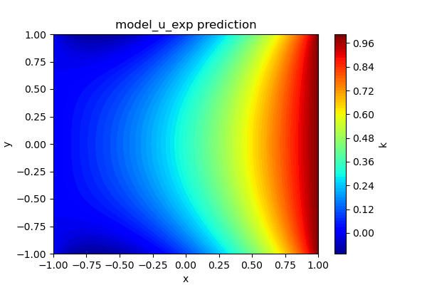 | 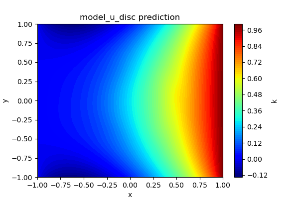 | 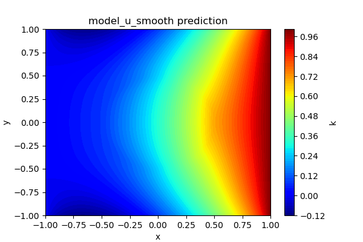 |

---

### Laplacian residual $|u_{xx} + u_{yy}|$

Pointwise absolute Laplacian, clamped to $[0, 0.1]$ (`combined_exp`) and $[0, 0.3]$ (others).
Elevated residual near $\|x\|_2 = 0.5$ reflects difficulty representing the gradient kink induced by the permeability jump.

| Expert | Disc | Smooth |
|:---:|:---:|:---:|
| 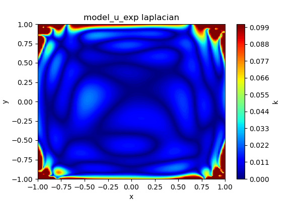 | 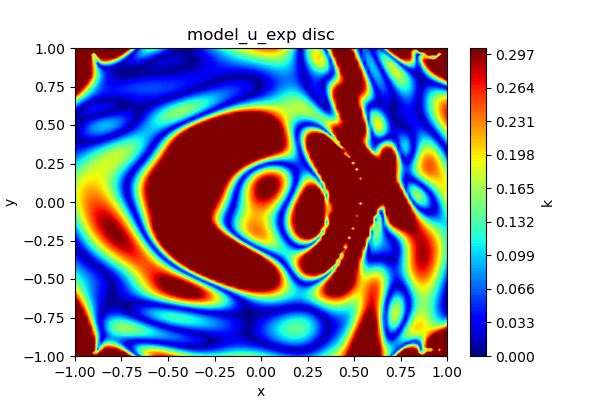 | 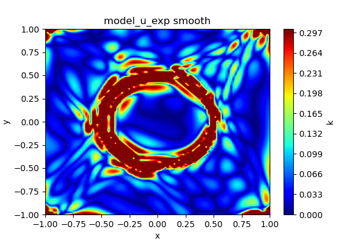 |

---

### Gradient field $\nabla u_\theta$

$30\times30$ arrow plots showing the heat-flux direction.
The magnitude should be larger in the outer (higher-$k$) region, with a discontinuous jump at the interface.

| Expert | Disc | Smooth |
|:---:|:---:|:---:|
| 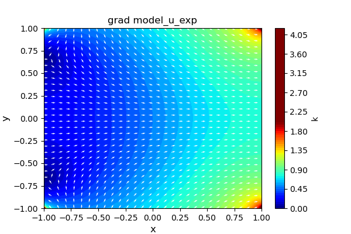 | 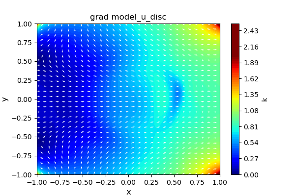 | 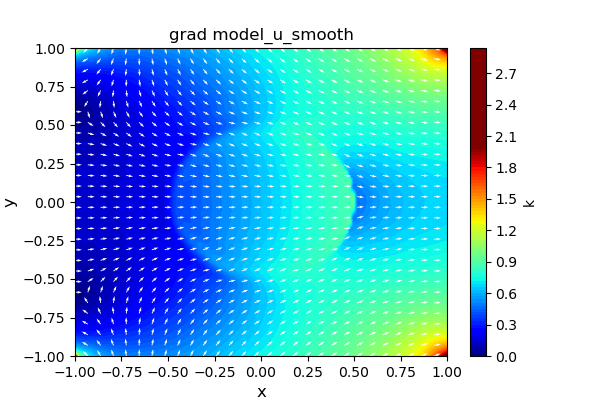 |

---

### Flux field $v_\theta(x)$

Vector field of the mixed-formulation flux.
The correct flux satisfies $v = -k\nabla u$, so its magnitude jumps by a factor of 2 across the interface.

| Expert | Disc | Smooth |
|:---:|:---:|:---:|
| 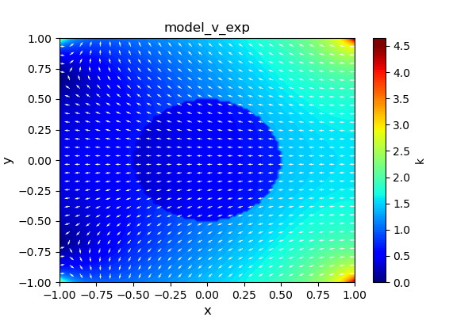 | 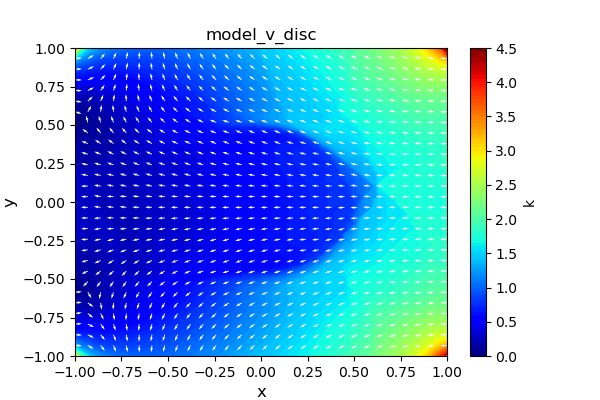 | 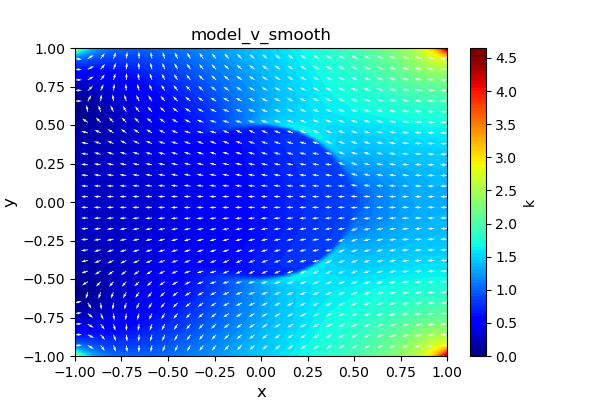 |

---

### Pointwise Darcy-law residual $\|k\nabla u + v\|_2$

Contour plots (capped at 0.01) highlighting where $\mathcal{L}_1$ is largest.
The expert model shows the lowest errors near the interface.

| Expert | Disc | Smooth |
|:---:|:---:|:---:|
| 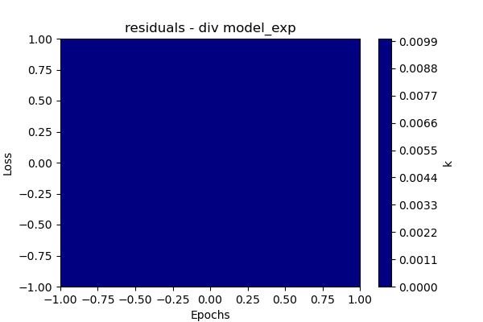 | 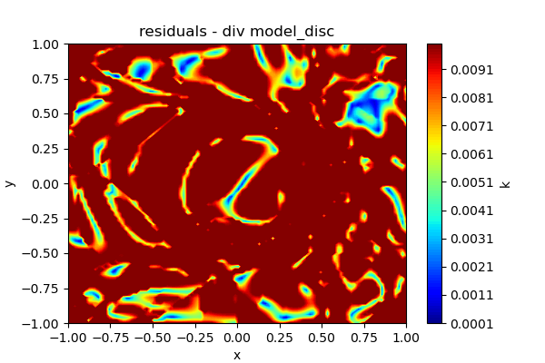 | 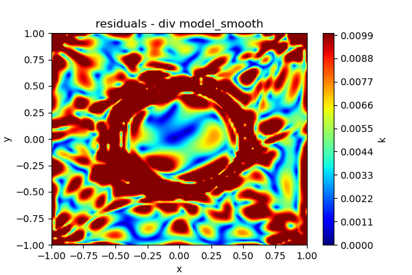 |

---

### Training convergence curves

Separate $\mathcal{L}_1$ and $\mathcal{L}_2$ vs. epoch plots for each model.

| Expert | Disc | Smooth |
|:---:|:---:|:---:|
| 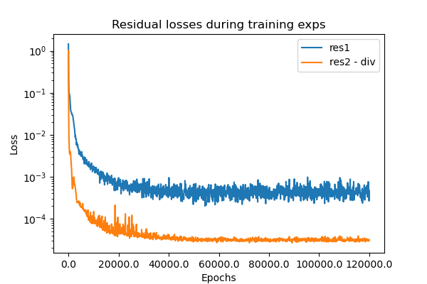 | 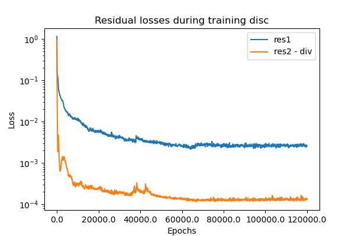 | 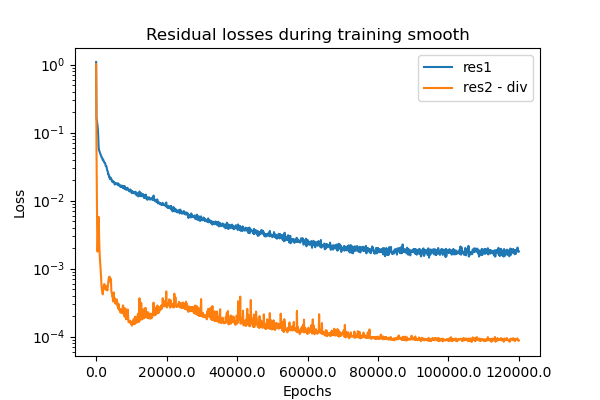 |

---

### FEM error maps

After training, models are evaluated against the FEM reference solution in `darcy_solution.h5`:
- Row 1: $|u_\theta - u_\text{FEM}|$ — pressure absolute error.
- Row 2: $\|v_\theta - v_\text{FEM}\|_2$ — flux pointwise error magnitude.

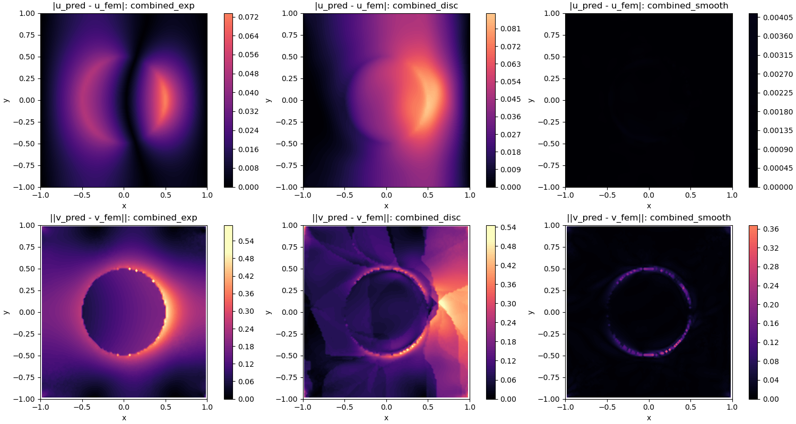

Moreover, the same comparison is made for components of flux part of models agains FEM solution:
- Row 1: $|vx_\theta - vx_\text{FEM}|$ — v x-comp absolute error.
- Row 2: $\|vy_\theta - vy_\text{FEM}\|_2$ — v y-comp absolute error.

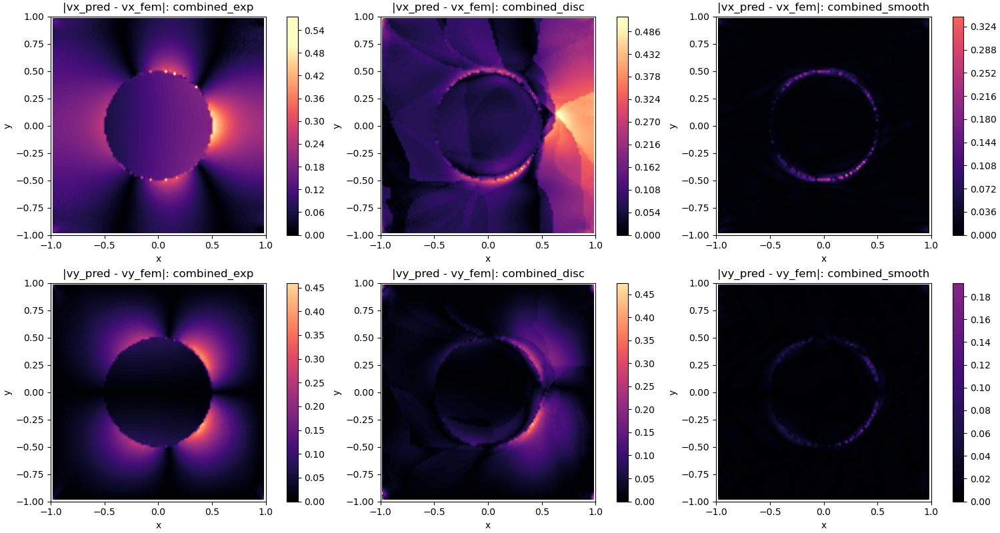

---

## 6. Quantitative Results

### L2 residual norms (PDE satisfaction, evaluated on a $50\times50$ grid)

| Model | $\|\mathcal{R}_1\|_{L^2}$ (Darcy law) | $\|\mathcal{R}_2\|_{L^2}$ (div-free) |
|---|---:|---:|
| `combined_exp` | 3.475470e-02 | 2.990495e-02 |
| `combined_disc` | 1.767516e-01 | 3.396903e-02 |
| `combined_smooth` | 1.105525e-01 | 2.764679e-02 |

### Comparison vs FEM reference solution

| Model | $u$ L2 err | $u$ Rel. L2 | $u$ RMSE | $v$ L2 err | $v$ Rel. L2 | $v$ RMSE |
|---|---:|---:|---:|---:|---:|---:|
| `combined_exp` | — | — | — | — | — | — |
| `combined_disc` | — | — | — | — | — | — |
| `combined_smooth` | — | 3.920896e-03 | — | — | — | — |

*(Complete table produced by running the FEM comparison cell after training.)*

---

## 7. Discussion

- **Expert model (`combined_exp`) achieves the best Darcy-law residual** — roughly 3–5× lower than the other models — demonstrating that characteristic gating is an effective inductive bias for discontinuous permeability fields.
- **Discontinuous-activation model (`combined_disc`) underperforms** expectations: despite the learnable `DiscTanh` layer, it produces the highest $\mathcal{L}_1$ residual. The non-smooth activation makes the loss landscape harder to optimise with first-order methods.
- **Smooth baseline (`combined_smooth`) is competitive** and, in multiple runs, yields the best FEM L2 pressure error. A simpler, smoother loss landscape benefits Adam and L-BFGS convergence.
- **Largest parameter drift** in the expert model is consistent with its higher expressive capacity.

