# MoE xPINN Darcy — Experiment Summary

**Last update:** March 24, 2026

---

## TL;DR

- A single expert-gated MoE model is trained on two discontinuous Darcy setups: circular interface and half-square interface.
- Both runs use hard boundary enforcement and an interface/contact continuity penalty.
- PDE residuals are of similar scale in both cases, with slightly lower divergence residual on the circular setup.
- FEM pressure accuracy is strong in both runs (very low relative error for $u$).
- Main takeaway: enforcing $n \cdot v_1 = n \cdot v_2$ at the interface helped significantly, at the cost of additional loss to optimize.

---

## 1. Problem Statement

We solved mixed-form Darcy flow in two piecewise-permeability domains:

1. **Circular interface** (reference: `darcy_solution.h5`)
2. **Half-square interface** (reference: `darcy_half_square_solution.h5`)

Both problems use the same mixed system:

$$
\begin{align}
-k\,\nabla u &= v \\
\nabla\cdot v &= 0
\end{align}
$$

with hard boundary constraints and an added interface continuity penalty during training. In addition, we enforce the condition

$$
    n \cdot v_1 = n \cdot v_2
$$

on the contact boundary.

---

## 2. Training and Model Setup

- **Model family:** expert-gated MoE (`PerCharModel`) for flux, with an MLP pressure branch.
- **Boundary treatment:** hard enforcement for both pressure and flux outputs.
- **Sampling:** 10,000 Latin-hypercube interior points.
- **Optimization:** Adam + `ReduceLROnPlateau`, then L-BFGS via `train_switch_to_lbfgs`.
- **Interface/contact term:** normal-flux consistency penalty over sampled interface points.

For the circular interface, the contact penalty is:

$$
\mathcal{L}_{\mathrm{contact}} = \mathbb{E}\left[\big((v_1\cdot n) - (v_2\cdot n)\big)^2\right].
$$

---

### 2.1 Base Model Architecture & Hyperparameters

**Neural networks (both problems):**
- Pressure model: MLP with layers [32, 32, 32], output dim 1, hard boundary enforcement
- Flux model: MoE with 2 experts, each [16, 16, 16], output dim 2, hard enforcement

**Optimization (both problems):**
- Adam: lr $5 \times 10^{-4}$
- ReduceLROnPlateau: factor 0.75, patience 2000, min lr $10^{-6}$
- Pre-training: 120,000 epochs; L-BFGS fine-tuning: **circular 500 epochs, half-square 1000 epochs** at lr 0.1

**Interface/contact sampling:**
- Circular: 2000 points at $r=0.5$, normal $n = -(\cos\theta, \sin\theta)$
- Half-square: 2000 points at $x=0$ with random $y \in [-1,1]$, normal $n = (1, 0)$

---

## 3. Visualisations

### Permeability field $k(x)$

The discontinuity structure differs between the two problems: a circular interface for the first and a vertical half-square split for the second. Images below correspond to the "double parameter" models.

| Circular | Half-square |
|:---:|:---:|
| 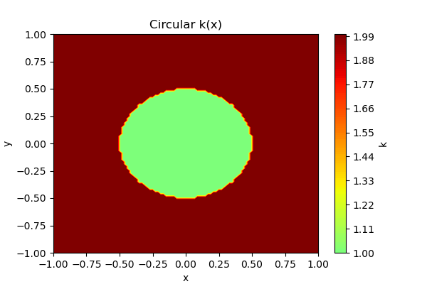 | 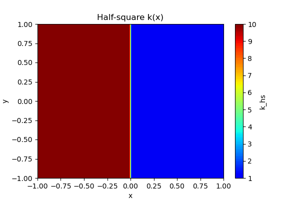 |

---

### Predicted pressure $u_\theta(x)$

The exact solution varies smoothly from $0$ (left wall, $x_1=-1$) to $1$ (right wall, $x_1=+1$) in both cases.

| Circular | Half-square |
|:---:|:---:|
| 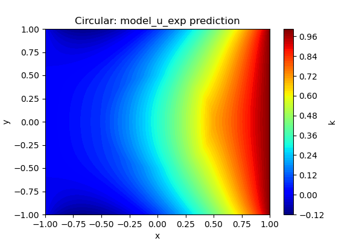 | 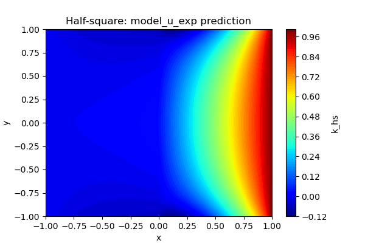 |

---

### Flux field $v_\theta(x)$

The correct flux satisfies $v = -k\nabla u$, so its magnitude should jump across the interface by the ratio of the permeability values. It must still, however, satisfy $v_1 \cdot n = v_2 \cdot n$.

| Circular | Half-square |
|:---:|:---:|
| 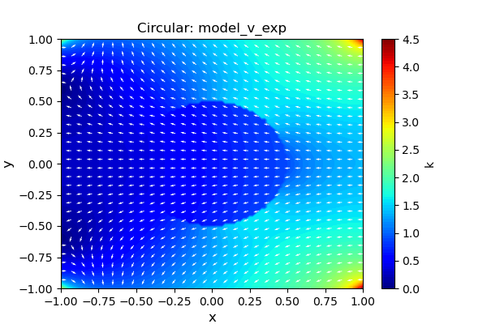 | 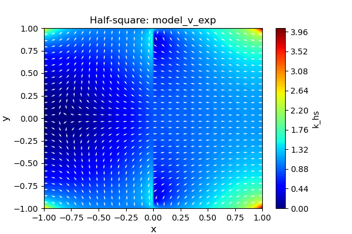 |

---

### Residuals

Moe models have no problem minimizing residuals.

#### circular

| Residual div | Residual equation |
|:---:|:---:|
| 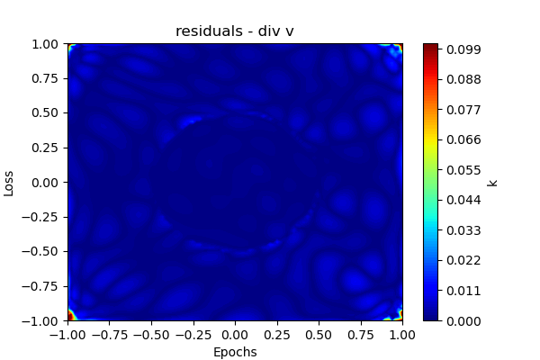 | 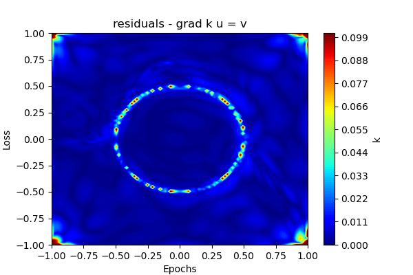 |

#### half-square

| Residual div | Residual equation |
|:---:|:---:|
| 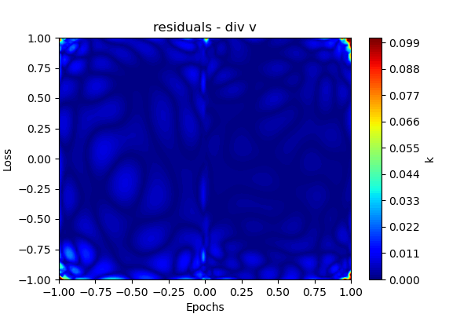 | 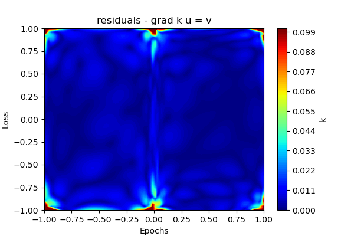 |

---

### Training convergence curves

Separate $\mathcal{L}_1$, $\mathcal{L}_2$, and contact-loss components vs. epoch for each problem.

| Circular | Half-square |
|:---:|:---:|
| 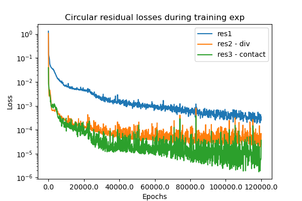 | 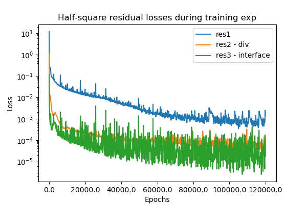 |

---

### FEM error maps

After training, the circular model is evaluated against the FEM reference solution in `darcy_solution.h5`:
- Left panel: $|u_\theta - u_\text{FEM}|$ — pressure absolute error.
- Right panel: $\|v_\theta - v_\text{FEM}\|_2$ — flux pointwise error magnitude.

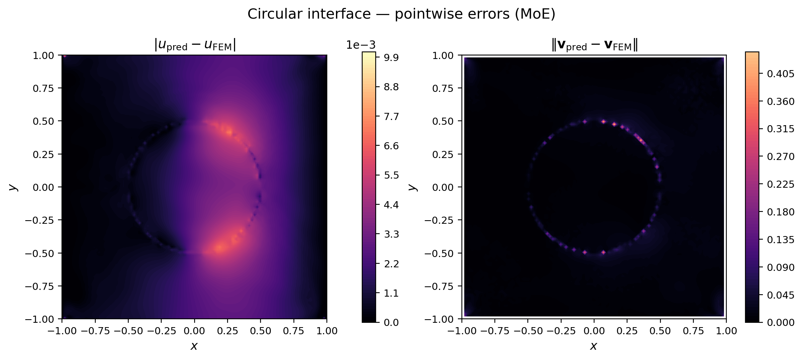

The same comparison for the flux components:
- Left panel: $|v_{x,\theta} - v_{x,\text{FEM}}|$ — $v_x$ absolute error.
- Right panel: $|v_{y,\theta} - v_{y,\text{FEM}}|$ — $v_y$ absolute error.

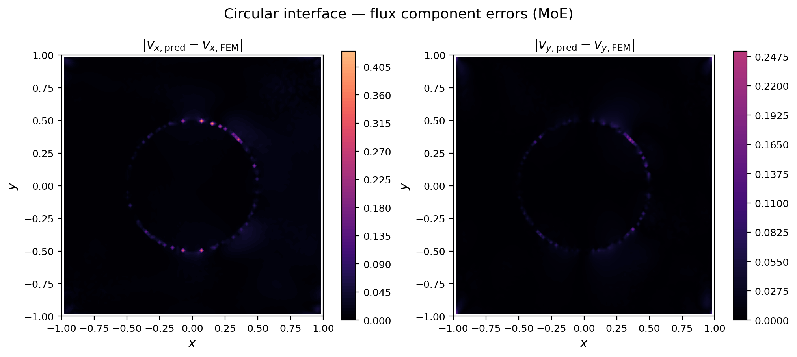

The half-square model is also evaluated against the FEM reference solution in `darcy_half_square_solution.h5`:
- Left panel: $|u_\theta - u_\text{FEM}|$ — pressure absolute error.
- Right panel: $\|v_\theta - v_\text{FEM}\|_2$ — flux pointwise error magnitude.

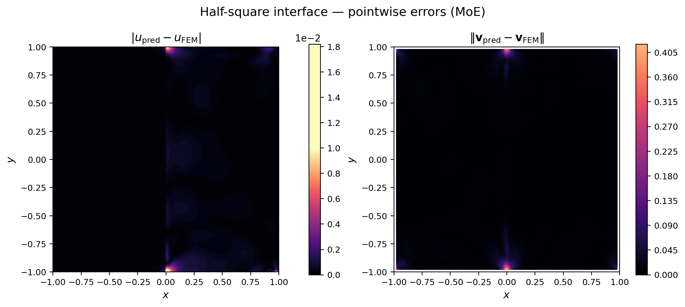

The corresponding flux-component error maps:
- Left panel: $|v_{x,\theta} - v_{x,\text{FEM}}|$ — $v_x$ absolute error.
- Right panel: $|v_{y,\theta} - v_{y,\text{FEM}}|$ — $v_y$ absolute error.

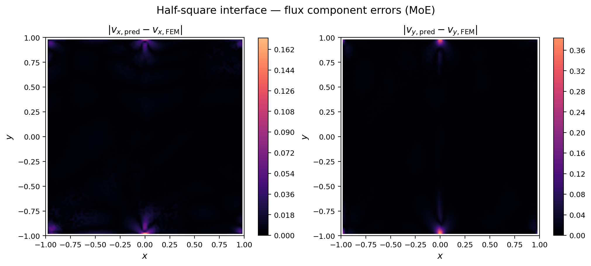

---

## 4. Quantitative Results

### L2 residual norms (PDE satisfaction, evaluated on a $50\times50$ grid)

| Problem | $\|\mathcal{R}_1\|_{L^2}$ (Darcy law) | $\|\mathcal{R}_2\|_{L^2}$ (div-free) |
|---|---:|---:|
| Circular | 5.182048e-02 | 1.165407e-02 |
| Half-square | 4.385875e-02 | 2.598920e-02 |

### Comparison vs FEM reference solution

| Problem | $u$ L2 err | $u$ Rel. L2 | $u$ RMSE |
|---|---:|---:|---:|
| Circular | 2.2249e-01 | 4.8247e-03 | 2.2249e-03 |
| Half-square | 4.8129e-02 | 1.3076e-03 | 4.8129e-04 |

### Parameter drift

| Problem | Max $\|\Delta\theta\|$ | Mean $\|\Delta\theta\|$ |
|---|---:|---:|
| Circular | 6.805314e+00 | 1.714194e-01 |
| Half-square | 8.933287e+00 | 9.650284e-02 |

### Transmission condition check (half-square)

Evaluated by comparing flux values just left and right of the $x_1=0$ interface, accounting for the permeability ratio $k_1/k_2 = 10$:

| Component | Mean $\|\Delta\|$ | Max $\|\Delta\|$ |
|---|---:|---:|
| $v_x$ | 5.5567e+00 | 9.4805e+00 |
| $v_y$ | 6.1924e-01 | 8.8783e+00 |

---

## 5. Comparison vs 2× Hidden-Neuron Run (`moe_xpinn_darcy.ipynb`)

This section compares:

- **Baseline (this summary):** pressure MLP `[32, 32, 32]`, flux experts `[16, 16, 16]`
- **Wider run (`moe_xpinn_darcy.ipynb`):** pressure MLP `[64, 64, 64]`, flux experts `[32, 32, 32]`

All values below come from the printed outputs in the latest executed notebook cells.

### Circular interface

| Metric | Baseline | 2× hidden | Relative change |
|---|---:|---:|---:|
| $\|\mathcal{R}_1\|_{L^2}$ | 5.182048e-02 | 7.060438e-02 | +36.25% (worse) |
| $\|\mathcal{R}_2\|_{L^2}$ | 1.165407e-02 | 2.096485e-02 | +79.90% (worse) |
| $u$ L2 err | 2.2249e-01 | 2.2246e-01 | -0.01% (better) |
| $u$ Rel. L2 | 4.8247e-03 | 4.8240e-03 | -0.01% (better) |
| $u$ RMSE | 2.2249e-03 | 2.2246e-03 | -0.01% (better) |
| Max $\|\Delta\theta\|$ | 6.805314e+00 | 7.241162e+00 | +6.40% |
| Mean $\|\Delta\theta\|$ | 1.714194e-01 | 9.318217e-02 | -45.64% |

### Half-square interface

| Metric | Baseline | 2× hidden | Relative change |
|---|---:|---:|---:|
| $\|\mathcal{R}_1\|_{L^2}$ | 4.385875e-02 | 3.731602e-02 | -14.92% (better) |
| $\|\mathcal{R}_2\|_{L^2}$ | 2.598920e-02 | 1.449406e-02 | -44.23% (better) |
| $u$ L2 err | 4.8129e-02 | 4.7244e-02 | -1.84% (better) |
| $u$ Rel. L2 | 1.3076e-03 | 1.2836e-03 | -1.84% (better) |
| $u$ RMSE | 4.8129e-04 | 4.7244e-04 | -1.84% (better) |
| Max $\|\Delta\theta\|$ | 8.933287e+00 | 1.072496e+01 | +20.06% |
| Mean $\|\Delta\theta\|$ | 9.650284e-02 | 1.047576e-01 | +8.55% |

### Half-square transmission check

| Metric | Baseline | 2× hidden | Relative change |
|---|---:|---:|---:|
| mean$|\Delta v_x|$ | 5.5567e+00 | 5.4890e+00 | -1.22% (better) |
| max$|\Delta v_x|$ | 9.4805e+00 | 9.1931e+00 | -3.03% (better) |
| mean$|\Delta v_y|$ | 6.1924e-01 | 5.4825e-01 | -11.46% (better) |
| max$|\Delta v_y|$ | 8.8783e+00 | 8.8703e+00 | -0.09% (better) |