# MoE XPiNN with Learned POU — Darcy Flow Summary

## Problem

Mixed-form Darcy flow on the unit square $[-1,1]^2$:

$$\begin{align*}
    -k \nabla u &= v, \\
    \nabla \cdot v &= 0,
\end{align*}$$

with Dirichlet condition $u = \tfrac{1}{2}(x+1)$ and Neumann condition $v = h$ on the respective boundaries. The permeability is piecewise constant:

$$k(x) = \begin{cases} 1 & \|x\|_2 < 0.5 \\ 2 & \text{otherwise.} \end{cases}$$

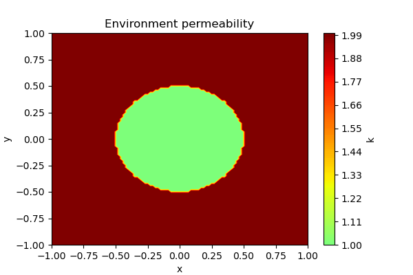

---

## Stage 1 — Learning the Partition of Unity (POU)

A dedicated MLP (`model_char`) is trained to classify interior vs. exterior of the disk interface. It is then thresholded at 0.5 to produce the binary POU indicator $\chi$.

**Architecture:** fully-connected MLP, input 2 → layers [64, 64, 64, 64, 64] → output 1, ReLU last activation.  
**Training:** 60 000 Adam epochs (lr = 1e-4) + 1 000 L-BFGS steps.  
**Loss:** $\mathbb{E}\bigl[(u - \mathbf{1}_{k=1})^2\bigr]$ on interior collocation points (30 000, Latin sampling).

The learned POU closely matches the true indicator $\chi$, with pointwise error clipped to $[0, 10^{-4}]$:

| Learned POU | POU pointwise error |
|:-----------:|:-------------------:|
| 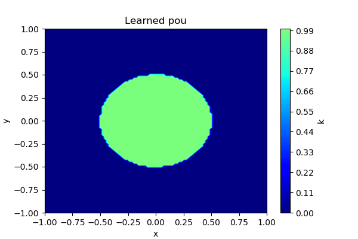 | 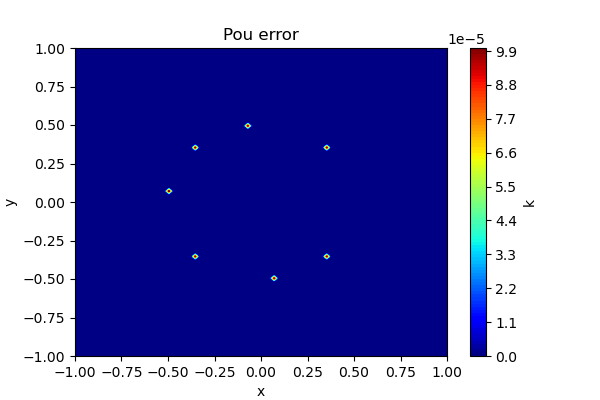 |

---

## Stage 2 — Normal Vectors on the Interface

The level-set contour of `model_char` at value 0.5 is extracted with `skimage.measure.find_contours` on a $1300 \times 1300$ grid (sub-pixel linear interpolation). The gradient of `model_char` is then evaluated at each contour point via automatic differentiation; the unit outward normal is

$$n = -\frac{\nabla \texttt{model\_char}}{\|\nabla \texttt{model\_char}\|_2}.$$

The extracted contour aligns well with the true circle of radius 0.5:

| Contour vs. true interface | Normal vectors |
|:--------------------------:|:--------------:|
| 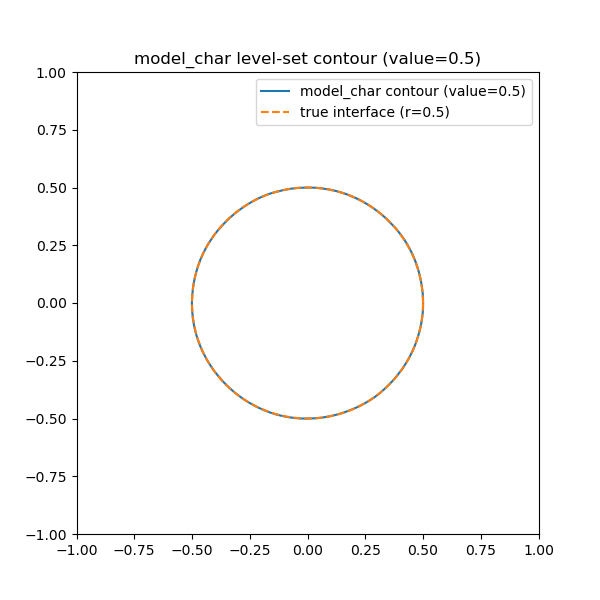 | 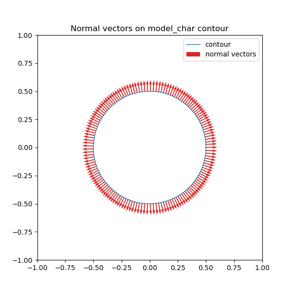 |

---

## Stage 3 — Main Model Training

Two sub-models are combined into a single `MultiModel`:

| Sub-model | Role | Architecture | Hard BCs |
|-----------|------|--------------|----------|
| `model_u_exp` | scalar potential $u$ | MLP 2 → [32, 32, 32] → 1 | Dirichlet $g_D$ via `u_0` |
| `model_v_exp` | flux $v$ (MoE, 2 experts) | 2 × MLP 2 → [16, 16, 16] → 2 | Neumann $h$ via `v_0` |

Each expert of `model_v_exp` is gated by $\chi_\text{learned}$ and $1-\chi_\text{learned}$ respectively.

**Training:** 120 000 Adam epochs (lr = 5e-4, `ReduceLROnPlateau` factor 0.75, patience 2 000) + 1 000 L-BFGS steps; 10 000 interior collocation points.

**Loss terms:**

1. $\|k\,\nabla u + v\|^2$ — equation residual,
2. $\|\nabla \cdot v\|^2$ — divergence-free residual,
3. $\mathbb{E}\bigl[(\langle v_1, n\rangle - \langle v_2, n\rangle)^2\bigr]$ — flux-continuity across the interface.

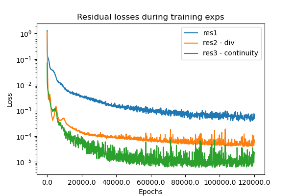

---

## Results

### Solution fields

| $u$ prediction | $\nabla u$ |
|:-:|:-:|
| 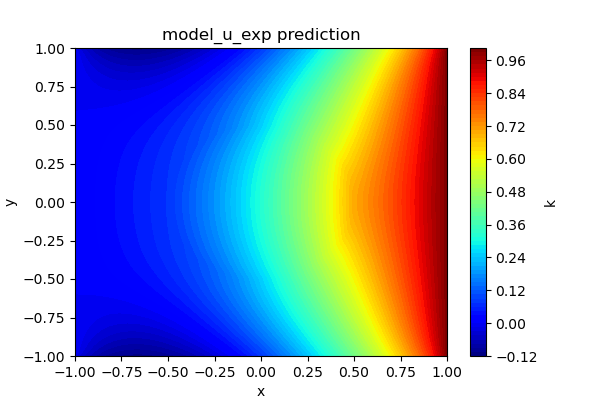 | 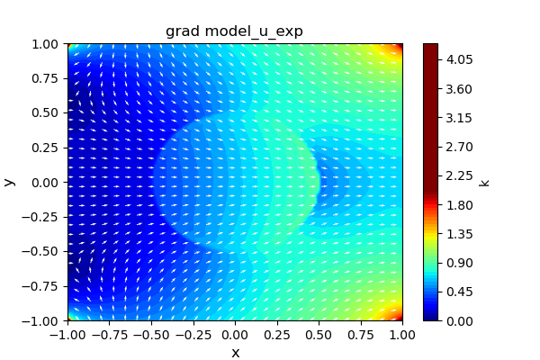 |

| $v$ field | Laplacian residual (clamped to 0.1) |
|:-:|:-:|
| 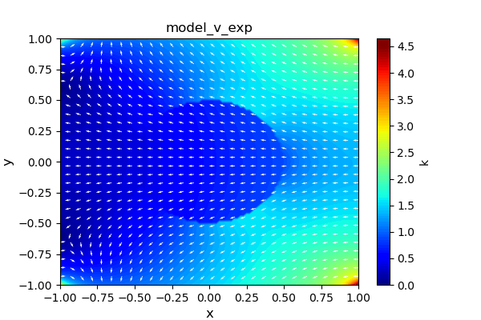 | 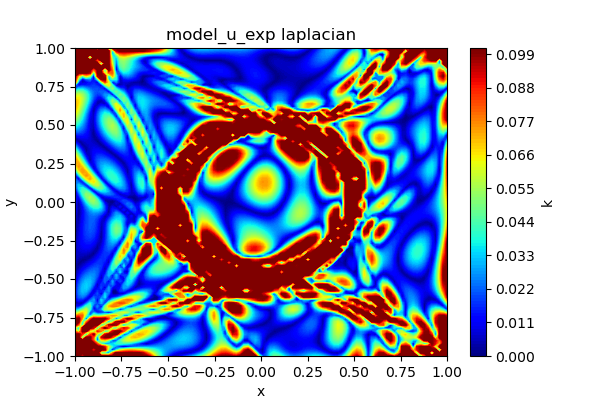 |

### PDE residuals

| Equation residual $\|k\,\nabla u + v\|$ | Divergence residual $\|\nabla\cdot v\|$ |
|:-:|:-:|
| 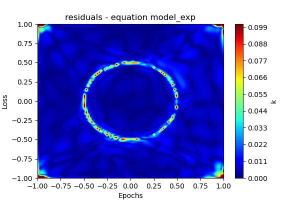 | 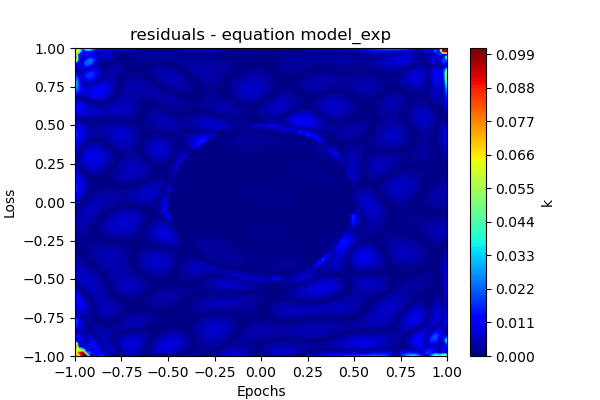 |

Both residuals are small across the domain; larger values appear near the discontinuity at the interface, as expected.

### Comparison with FEM reference

Errors relative to an FEM solution from `darcy_solution.h5`:

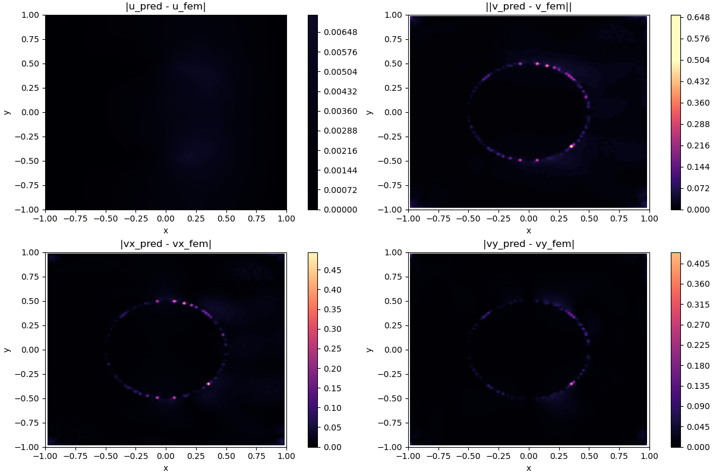

The error in $u$ is concentrated near the interface (where $k$ is discontinuous). The flux error $\|v_\text{pred} - v_\text{fem}\|$ is larger in magnitude but remains localised.

---

## Key Takeaways

- **Learned POU:** training a classifier network to detect the material interface, then thresholding it to create true characteristic function of a given region, provides a differentiable and accurate partition of unity without manual geometry specification.
- **Normal vector extraction:** automatic differentiation on the POU model's level-set contour gives smooth, accurate interface normals that drive the flux-continuity penalty.
- **MoE decomposition:** separate expert networks per subdomain, gated by the learned POU, allow each expert to specialise on one material region and improve solution quality near the jump in $k$.
- **Convergence:** the loss decreases consistently for all three components; residuals are small away from the interface, confirming that the model has converged to a physically reasonable solution.
