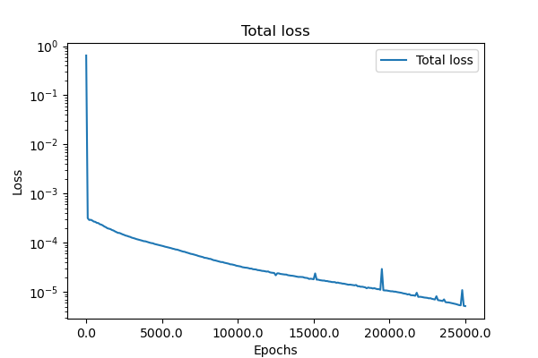
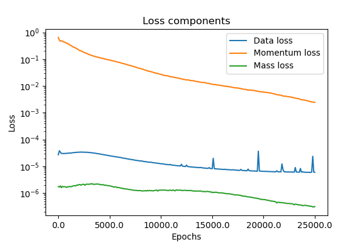
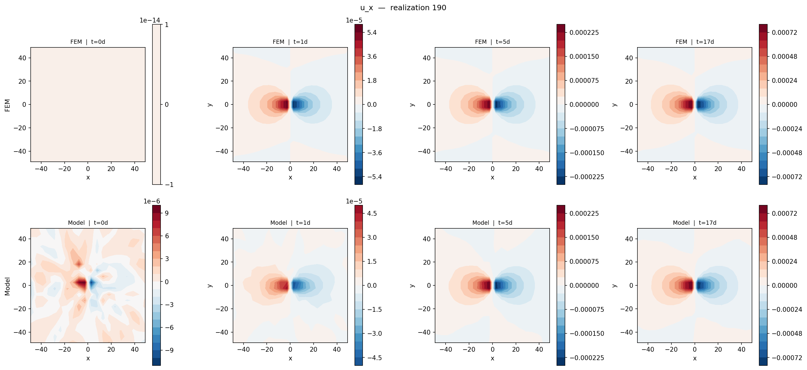
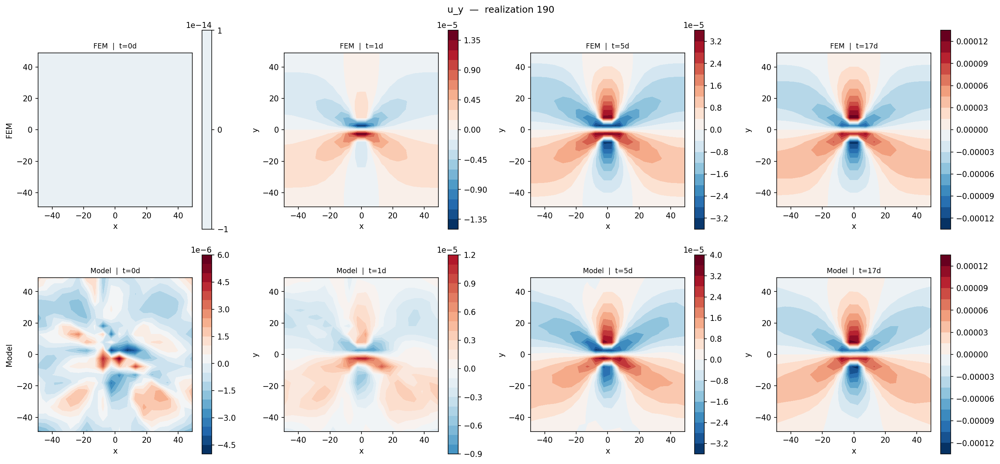
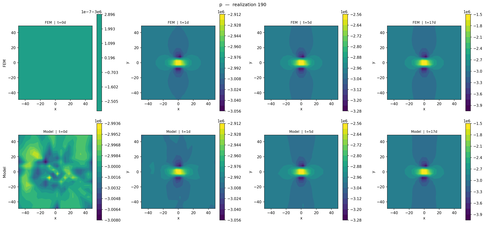

# Parametric Biot Consolidation — Summary

## Problem Description

This notebook solves the **parametric Biot poroelasticity equations** in a 2D annular domain ("aquarium") with a circular tunnel of radius $R = 2\,\text{m}$ centred at the origin, embedded in a $100\,\text{m} \times 100\,\text{m}$ square.

The goal is to learn a single neural network that maps both **spatial/temporal inputs** $(x, y, t)$ **and stochastic parameters** $\boldsymbol{\xi} \in \mathbb{R}^8$ to the three solution fields:

$$\mathbf{u}(x, y, t; \boldsymbol{\xi}) = (u_x,\, u_y),\quad p(x, y, t; \boldsymbol{\xi})$$

---

## Governing Equations

### Momentum balance (linear elasticity + Biot coupling)

$$-\nabla \cdot \boldsymbol{\sigma} = 0, \quad \boldsymbol{\sigma} = 2\mu\boldsymbol{\varepsilon}(\mathbf{u}) + \lambda(\nabla\cdot\mathbf{u})\mathbf{I} - \alpha p\mathbf{I}$$

with strains $\varepsilon_{xx}=\partial_x u_x$, $\varepsilon_{yy}=\partial_y u_y$, $\varepsilon_{xy}=\tfrac{1}{2}(\partial_y u_x+\partial_x u_y)$, Lamé parameters

$$\mu = \frac{E}{2(1+\nu)}, \qquad \lambda = \frac{E\nu}{(1+\nu)(1-2\nu)}$$

derived from $E = 6 \times 10^{10}\,\text{Pa}$, $\nu = 0.2$, and Biot coefficient $\alpha = 0.2$. The $-\alpha p\mathbf{I}$ term is the effective-stress coupling (total stress = elastic stress minus pore pressure contribution).

The 2D strong-form residuals enforced by the PINN are:

$$r_x = -\left(\partial_x \sigma_{xx} + \partial_y \sigma_{xy}\right) = 0$$
$$r_y = -\left(\partial_x \sigma_{xy} + \partial_y \sigma_{yy}\right) = 0$$

### Mass balance (fluid flow)

$$C_0 \partial_t p + \alpha \partial_t (\nabla \cdot \mathbf{u}) - \nabla \cdot (K(\boldsymbol{x};\boldsymbol{\xi})\,\nabla p) = 0$$

where the divergence of the flux is expanded as:

$$\nabla\cdot(K\nabla p) = K_x\,p_x + K\,p_{xx} + K_y\,p_y + K\,p_{yy}$$

with $K = K(\boldsymbol{x};\boldsymbol{\xi})/\mu_f$ ($\mu_f = 1.0$), storage coefficient $C_0 = 7.712 \times 10^{-12}$, and a **stochastic log-normal permeability field**:

$$\ln K(x, y; \boldsymbol{\xi}) = \ln k_0 + 0.35 \sum_{i=1}^{8} \gamma_i\, \xi_i\, \phi_i(x, y)$$

where $\phi_i$ are trigonometric basis functions and $\boldsymbol{\gamma} = [1.00,\, 0.70,\, 0.70,\, 0.50,\, 0.35,\, 0.35,\, 0.25,\, 0.25]$.

### Boundary conditions

- **Tunnel wall** ($r = R$): tunnel pressure $p_\text{tun}(t) = P_\text{outer}\max(0,\, 1 - t/t_\text{ramp})$ with $t_\text{ramp} = 17\,\text{days}$; zero displacement.
- **Outer boundary** ($r = 50$): $p = P_\text{outer} = -3\,\text{MPa}$; zero displacement.

---

## Model Architecture

A **multihead MLP** with shared trunk and separate heads for $\mathbf{u}$ and $p$:

| Component | Layers | Input dim | Output dim |
|-----------|--------|-----------|------------|
| Trunk | 11 → 64 → 64 → 64 | 11 | 64 |
| Head $\mathbf{u}$ | 64 → 32 → 2 | 64 | 2 |
| Head $p$ | 64 → 32 → 1 | 64 | 1 |

Input: $(x, y, t, \xi_1, \ldots, \xi_8) \in \mathbb{R}^{11}$, normalised to $[-1, 1]^{11}$.

**Hard boundary enforcement** is applied via multiplicative lifting functions:

$$\hat{u} = u_\text{lift}(x) + D_u(x) \cdot \text{MLP}_u(\text{trunk}(x))$$
$$\hat{p} = p_\text{lift}(x) + D_p(x) \cdot \text{MLP}_p(\text{trunk}(x))$$

ensuring Dirichlet conditions are satisfied exactly.

---

## Training Strategy

### Stage 1 — Data pretraining (5 000 epochs, Adam lr = 0.001)

Supervised fitting to FEM snapshots from 181 realisations (train set: realisation index ≤ 180):

$$\mathcal{L}_\text{data} = \frac{1}{N}\sum \left[\left(\frac{\hat{u}_x - u_x^\text{FEM}}{10^{-3}}\right)^2 + \left(\frac{\hat{u}_y - u_y^\text{FEM}}{10^{-3}}\right)^2 + \left(\frac{\hat{p} - p^\text{FEM}}{3\times10^6}\right)^2\right]$$

### Stage 2 — Physics-informed residual training (25 000 epochs, Adam lr = 0.0001)

Three-component loss with adaptive weight balancing:

$$\mathcal{L} = w_1 \mathcal{L}_\text{data} + w_2 \mathcal{L}_\text{momentum} + w_3 \mathcal{L}_\text{mass}$$

| Component | Scale | Initial weight |
|-----------|-------|----------------|
| Data | — | 0.05 |
| Momentum residual | $10^6\,\text{Pa/m}$ | 1.0 |
| Mass residual | $10^{-9}$ | 1.0 |

Weights are updated every 50 epochs via loss-ratio balancing (EMA $\beta = 0.9$).

The domain collocation points (10 000 interior points) are resampled every 50 epochs.

---

## Data

The FEM dataset (`tsx_training_samples_small.npz`) contains:

- **Realisations**: labelled by integer realization index; ≤ 180 used for training, > 180 for testing.
- **Query points**: $20 \times 20$ spatial grid inside the domain.
- **Time snapshots**: stored at several days in `store_days`.
- **Fields per point**: $u_x$, $u_y$, $p$.

---

## Validation Metrics

Relative $L^2$ errors evaluated on the test set after each training stage:

$$e_f = \frac{\|\hat{f} - f^\text{FEM}\|_2}{\|f^\text{FEM}\|_2}, \quad f \in \{u_x,\, u_y,\, p\}$$

Results are saved to `biot_images/metrics.json` when the validation cells are executed.

| Field | After pretraining | After residual training |
|-------|-------------------|------------------------|
| $u_x$ | 0.0015888761263340712 | 0.08416911214590073 |
| $u_y$ | 0.055769264698028564 | 0.08309050649404526 |
| $p$   |  0.0015888761263340712 | 0.0011655082926154137 |

> **Note:** Run the two validation cells in the notebook to populate `biot_images/metrics.json`, then fill in the table above with the printed values.

---

## Visualisation

For a chosen realization (`REAL = 190`), side-by-side contour plots compare FEM ground truth (top row) vs. model prediction (bottom row) across all stored time snapshots, produced separately for $u_x$, $u_y$, and $p$.

### Training loss

**Total loss**

**Loss components** (data, momentum, mass)

---

### Field comparisons — realization 190

**x-displacement $u_x$** (top: FEM, bottom: model)

**y-displacement $u_y$** (top: FEM, bottom: model)

**Pressure $p$** (top: FEM, bottom: model)

